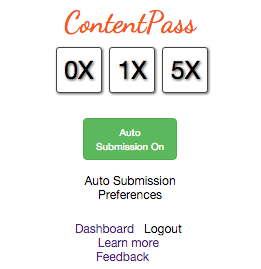

# [ContentPass](https://content-pass.herokuapp.com) Client (Google Chrome)
**ContentPass is in early alpha**

### Overview


[ContentPass](https://content-pass.herokuapp.com) is an idea to let readers pay writers automatically for the sites they visit. Initially, we're testing it out in the [Hacker News](https://news.ycombinator.com) community. While it doesn't solicit money right now, over time, you would select a monthly budget - and the money would be automatically amoritized across the relevant top Hacker News sites that you visit.

ContentPass Client (this repo) is a Google Chrome extension that works with ContentPass. It lets you sign in, submits relevant sites to our server, and change the weights of sites that you've visited.

The extension only sends our server sites that you visit that are in the top 150 on Hacker News - all other sites are excluded. When you are logged out, it will not communicate with our servers at all. Additionally, you can delete any sites you don't want to be recorded (our database removes these, without storing backups).

### Installation
First, compile the source files to ES5 Javascript:

1. Install the babel ES 2015 transpiler (`npm install -g babel`)
2. Run the compile script (`./compile.sh`); this will watch for any changes to the source files and automatically recompile (Ctrl-C out if you just want to run once)

Then add to Google Chrome:

1. In Google Chrome, navigate to `chrome://extensions`
2. Check the top right box that says Developer Mode
3. Click the button at top left that says *Load Unpacked Extension*
4. Select the root directory of this repo
5. Look for the *CO* icon on the right side of your Google Chrome toolbar
 - Click to login, you can sign up [here](https://content-pass.herokuapp.com/users/sign_up); once you're signed in, only the HN related top 150 sites will be sent to our server
 - You can additionally 5X sites you really like or 0X ones you don't, the badge will show the daily number of sites that it has recorded (you can always go to the [Dashboard](https://content-pass.herokuapp.com/dashboard))
 - Logout at anytime to stop HN-related sites being recorded


### Developers
#### Getting started
*File Structure*
- `precompiled/`: All major source files are in the precompiled directory
  - `popup.js`: Code related to the view
  - `extension_script.js`: Backend logic
  - `UrlVariation.js`: Library to generate variations of a given URL (http, https, with/without query parameters)
- `html/`, `css/`, `images/`: HTML, CSS, and images
- `js/precompiled`: All compiled files are output here when run through the `compile.sh` script, do not modify files in this folder as they will be overwritten

To setup auto-compilation:
```
npm install -g babel # babel is the ES2015 transpiler
./compile.sh # auto compiles files on change, updated versions are output to js/precompiled/
```
